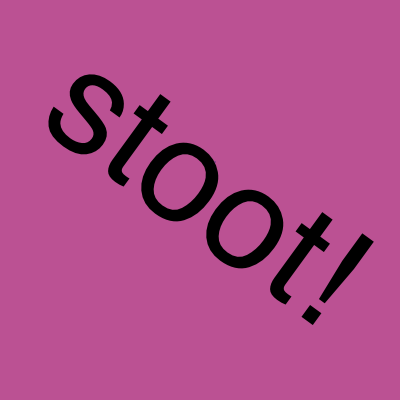
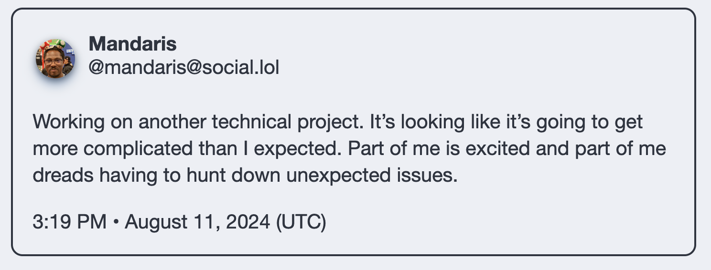
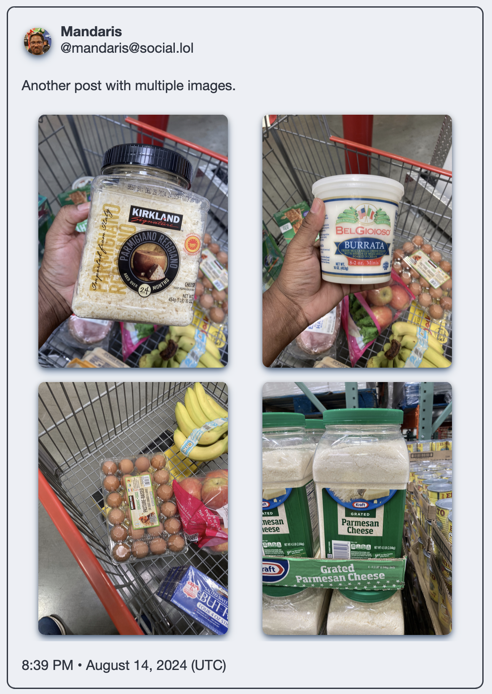
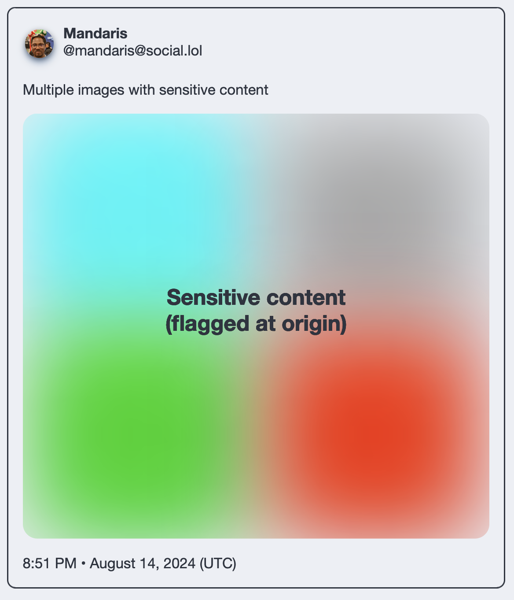
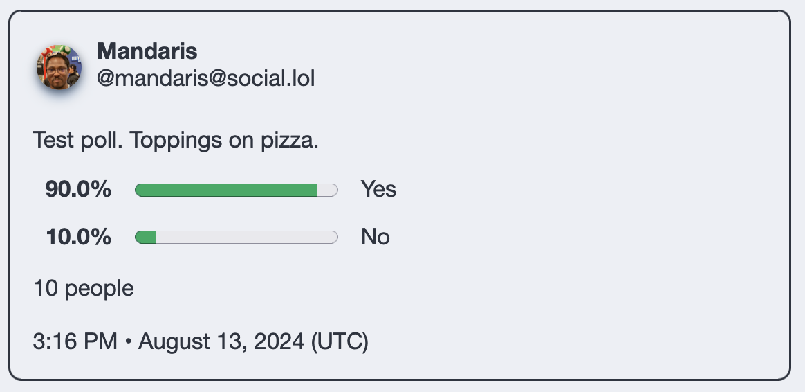

# Stoot shortcode

This is a Hugo shortcode that will allow you to embed a mastodon toot into your blog. It's 100% based off of [this post](https://www.brycewray.com/posts/2022/06/static-mastodon-toots-hugo/) by [Bryce Wray](https://www.brycewray.com). I think that you can find updates from the original author by looking at the [git repository](https://github.com/brycewray/hugo-site) for his site. 

My goal is to pull the specific code out so that I can use it on Micro.blog as a plugin for myself and others.

## Usage

The shortcode format looks like the following.

```

```

You would take the URL for a post such as this `https://social.lol/@mandaris/112944060166510117` and it should look something like the following.

```go

```

and the output will look something like this



The output for a post with multiple images will look like this



The output for a post with sensitive images will look like the following



The output for post with a poll will look like the following


### Turning off Open Graph card

Mastodon also includes opengraph information about the first link that it finds in the content of the toot. To disable it in the rendering, supply a value a third parameter like the example below.

```go-html-template

```

## Notes about the plugin

All the code was copy and pasted. I just packaged it up. I didn't make any changes because I'm not familiar with the Go programming language and want to easily get updates from Bryce.

This plugin does not cover the case of text that is content sensitive. 

> [!IMPORTANT]
> The plugin provides very little css styling. You can add custom css via the Micro.blog interface to get it looking like you want.

Also, I _DO_ know that I could use the iframe that mastodon provides to embed a post, but choose this as an option as it better integrates with the style of my blog.


## CSS classes


Toot-block
: This is the CSS class in the blockquote element that contains the entire mastodon post. 

Toot-header
: The div contains the information about the account that created the toot.

Toot-profile
: This is the profile image of the account that made the toot. I included this CSS from the original project to establish a baseline for styling.

Toot-author
: This is a div that contains the two links `toot-author-name` and `toot-author-name` that go to the same account page.

Toot-author-name
: The name that toot author is going by at the time of rendering. The names sometimes changes as decided by the person in charge of the account.

Toot-author-handle
: This is the account name in the `@name@server` format that mastodon likes to use.

Content
: This is the main text of your toot. 

Toot-img-grid
: Stoot includes CSS and logic to handle 1, 2, 3, or 4 images in a grid and render them properly.

Toot-video-wrapper
: Behind the scenes, there are two possible wrappers that render depending on what kind of video media is included with the toot. 

Toot-card
: This the div that contains the Open Graph card of the first link in the toot. This will include an image, title, and description from the website in the URL. 

Toot-poll-wrapper
: This is the div that containers HTML `<meter>` elements to convey the 

Toot-footer
: Contains date and time of the toot.

The <i>problem</i> is coming from the `toot-card` and I didn't want to change all the cards, because someone might have become reliant on this behaviour or worse - <em>never noticed it</em>.


### Further CSS Details
I didn’t want to make people work hard to style the included card, so I removed some styling from the CSS.


There are two `div` tags in the toot card that you can use to make things work to your satisfaction. 


## Version History

### 1.0.0

* Initial release

### 1.0.1

* Removed width so that the blockquote expands as needed

### 1.0.2

* Add new logo

### 1.0.3

* Add option to toggle Open Graph card on embedded toots

### 1.0.4

* Update the README.md

### 1.0.5

* Update the spacing

### 1.0.6

* Further reduce spacing

### 1.1.0

* Fix for try change in [Hugo 0.141.0](https://github.com/gohugoio/hugo/releases/tag/v0.141.0)

### 1.1.1

* Attempt to fix error